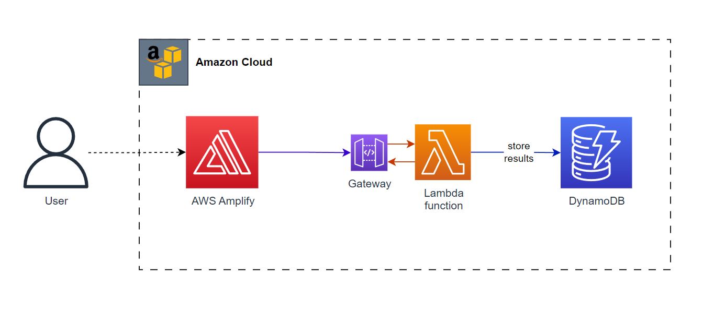

# Sample AWS Application

## Architecture
Very simple and straightforward architecture : We have a webpage to do some math calculation, hosted on **AWS AMPLIFY**. Upon entering the data, we send it to the lambda function to compute it. The result is then stored in a DynamoDB instance

